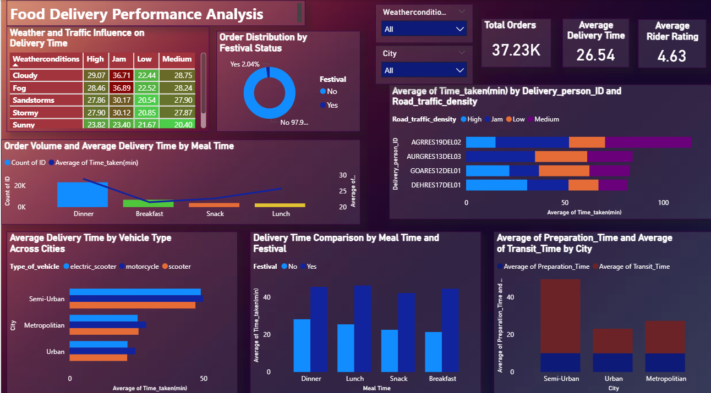

## Food Delivery Performance Analysis

### Overview
An end-to-end analysis of 37,000+ food delivery orders to identify 
key factors affecting delivery time, rider performance, and 
operational efficiency across weather, traffic, city, and 
festival conditions.

### Tools Used
Power BI

### Dashboard Preview

### Objectives & Key Findings

**1. External Factors Affecting Delivery Time**
- Fog and Stormy weather increase delivery times by 25–30%
- Heavy traffic during bad weather conditions compounds delays
- Recommendation: Adjust ETAs dynamically, optimize routes, 
  and monitor weather/traffic in real-time

**2. Delivery Partner Performance**
- Riders with higher ratings maintain more consistent delivery times
- Experience and efficiency directly influence delivery speed 
  and service quality

**3. Order Type & Vehicle Efficiency**
- Preparation time is consistent across cities at 10–15 minutes
- Electric Scooters perform well in Metropolitan areas; 
  Motorcycles are faster in Semi-Urban areas due to higher 
  speed limits and longer distances
- Recommendation: Deploy Electric Scooters in city centers, 
  Motorcycles in Semi-Urban areas

**4. Delivery Trends Over Time**
- Dinner has the highest order volume, leading to slightly 
  increased delivery times
- Additional riders needed during peak dinner hours to 
  maintain efficiency

**5. Festival Impact on Deliveries**
- Order demand increases during festivals, slightly raising 
  delivery times
- Proper rider planning during high-demand periods can 
  maintain delivery efficiency

### Dataset
Kaggle Food Delivery Dataset
